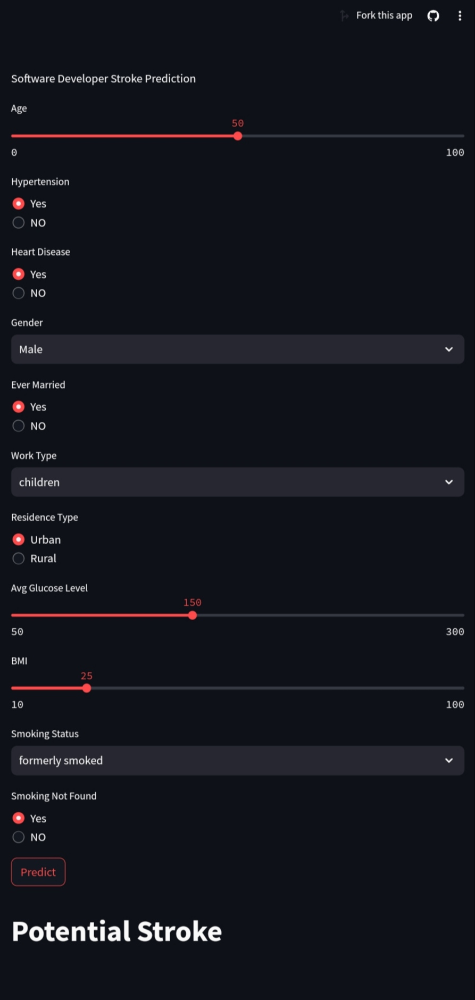

# Stroke Prediction Project 

## Introduction:

Welcome to the Stroke Prediction Project!! This project aims to develop a prediction model using machine learning techniques to determine whether an individual is at risk of stroke or not based on various factors such as gender, age, hypertension, heart disease, marital status, occupation, residence type, average glucose level, and BMI. It relies on diverse clinical data to train and evaluate the model's performance. This README file provides an overview of the project, including instructions for installation, usage, and suggested future improvements. We welcome contributions and feedback from the community to enhance the effectiveness and accuracy of this model.

## Features:

1. **Providing Medical Recommendations:** Based on the prediction results, the application and website can provide general recommendations for users to consult a doctor if there is a prediction of potential stroke risk, emphasizing the importance of accurate medical assessment.

2. **Enhancing Health Awareness:** By providing medical recommendations, the project can contribute to increasing and promoting health awareness among users regarding stroke prevention and treatment.

3. **Personal Risk Assessment:** In addition to predicting the risk of stroke, the application and website can provide users with an estimate of their personal risk level and the importance of consulting a doctor based on their personal and medical data.

4. **Offering Mobile and Web Applications:** The project is available in the form of a mobile application and a web application, both built on a machine learning model trained on data containing various factors such as age, gender, hypertension, heart disease, marital status, occupation, residence type, average glucose level, and BMI.

## Installation:

To use the web application, follow these steps:

1. Visit the web application at [Web App Using Streamlit](https://web-with-machine-nucec8gi3bzjgxpdxmtwqj.streamlit.app/) or [Web App using Reactjs](https://anasmas123.github.io/stroke_clinic/).
2. Input the required information for prediction.
3. Click the submit button to get the prediction result.

To install the mobile application, download the APK file from [here](https://github.com/Mohamed-Fathy-K/Cerebral-Stroke-Prediction-app-using-flutter-with-Ai-model-api/releases/download/V1.0/app-arm64-v8a-release.apk) and follow the installation instructions on your device.

## Usage:

Once installed, follow these steps to use the application:

1. Open the application on your device.
2. Provide the necessary information for prediction.
3. Tap the submit button to view the prediction result.

For additional information and to explore more about stroke prediction, you can visit the [Stroke Clinic](https://anasmas123.github.io/stroke_clinic/) website.

## Screenshots:

    
    
    
    
    
    

## Credits:

We would like to extend our gratitude to the following projects and contributors for their valuable resources and inspiration:

1. [Cerebral Stroke Prediction app using Flutter with Ai model API](https://github.com/Mohamed-Fathy-K/Cerebral-Stroke-Prediction-app-using-flutter-with-Ai-model-api) by Mohamed-Fathy-K
2. [Responsive-web-app <Stroke_clinic>](https://github.com/anasMAS123/stroke_clinic) by anasMAS123
3. [Machine-API](https://github.com/HalemoGPA/Machine-API) by HalemoGPA
4. [API with Machine](https://github.com/saadahmed313/api-with-machine) by saadahmed313
5. [Web with Machine](https://github.com/saadahmed313/Web-with-machine) by saadahmed313

We appreciate their contributions to the open-source community.
